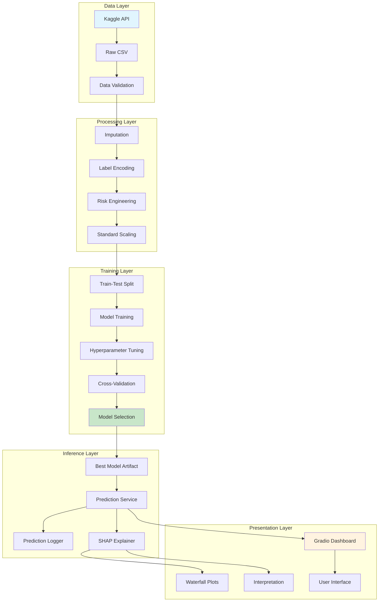
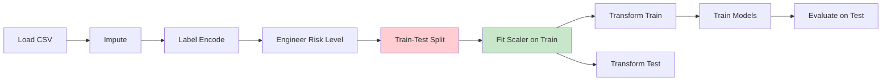
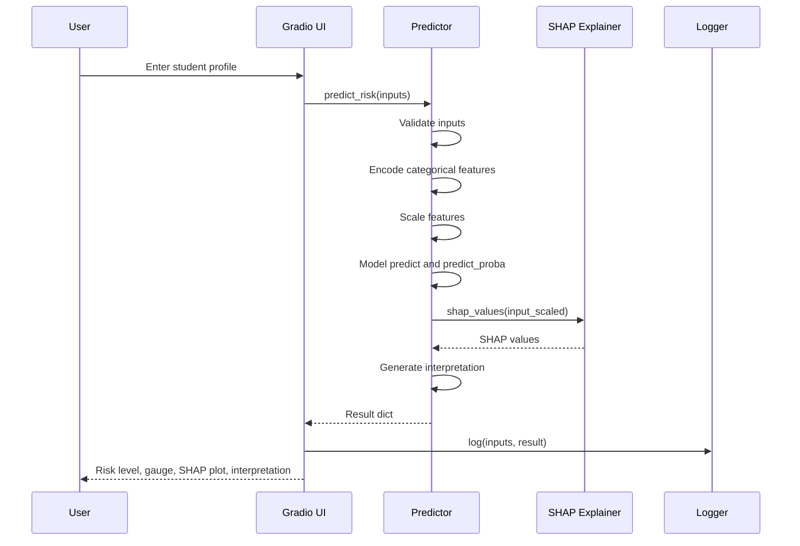
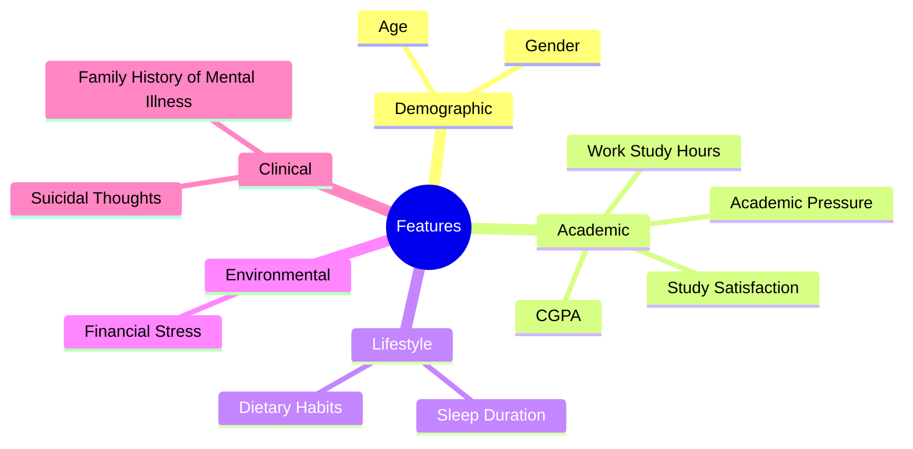
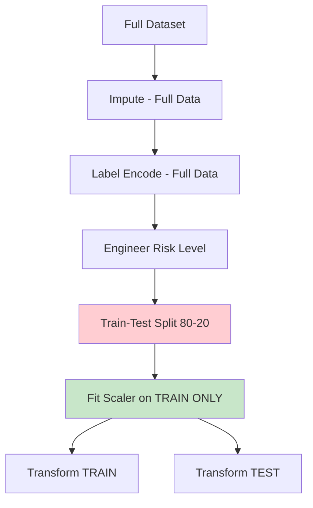
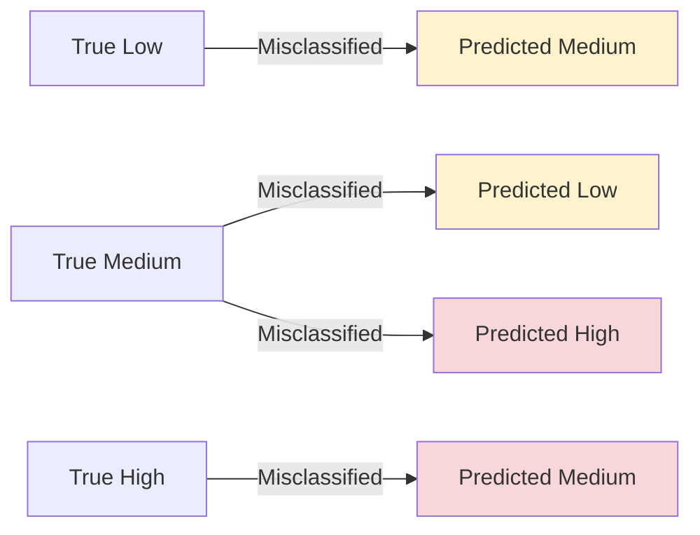
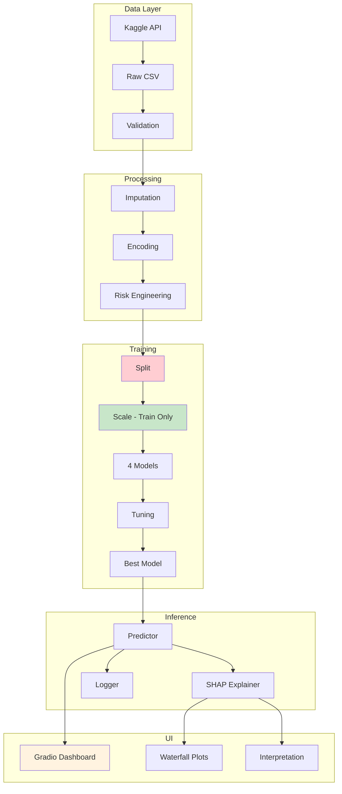
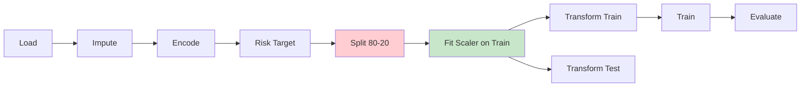
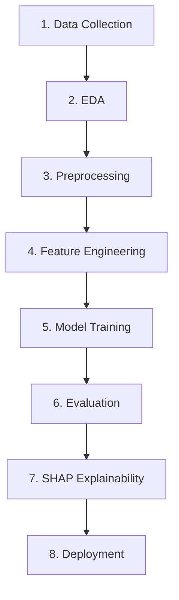

# Mermaid Diagrams — Copy-Paste Guide

All diagrams below are ready to paste. Each one shows:
- **File**: Which file to edit
- **Line**: Where the diagram starts (replace the existing ```mermaid block)
- **Clean Mermaid**: The fixed diagram code

---

## DIAGRAM 1 — High-Level Architecture

**File:** `docs/architecture.md`
**Line:** 9 (replace lines 9-48)

````

````

---

## DIAGRAM 2 — Data Flow (No Leakage)

**File:** `docs/architecture.md`
**Line:** 52 (replace lines 52-66)

````

````

---

## DIAGRAM 3 — Prediction Flow (Sequence Diagram)

**File:** `docs/architecture.md`
**Line:** 87 (replace lines 87-107)

````

````

---

## DIAGRAM 4 — Feature Selection Mindmap

**File:** `docs/methodology.md`
**Line:** 15 (replace lines 15-34)

````

````

> **Note:** Changed "Work/Study Hours" to "Work Study Hours" — the `/` character breaks Mermaid rendering.

---

## DIAGRAM 5 — Preprocessing Pipeline

**File:** `docs/methodology.md`
**Line:** 56 (replace lines 56-68)

````

````

> **Note:** Changed "80/20" to "80-20" — the `/` character breaks Mermaid rendering.

---

## DIAGRAM 6 — Error Patterns

**File:** `docs/results.md`
**Line:** 109 (replace lines 109-120)

````

````

> **Note:** Removed colons from labels — "True: Low" → "True Low" to avoid parsing issues.

---

## DIAGRAM 7 — System Overview (README)

**File:** `README.md`
**Line:** 81 (replace lines 81-118)

````

````

---

## DIAGRAM 8 — Data Flow (README)

**File:** `README.md`
**Line:** 122 (replace lines 122-136)

````

````

> **Note:** Changed "80/20" to "80-20".

---

## DIAGRAM 9 — ML Pipeline (README)

**File:** `README.md`
**Line:** 197 (replace lines 197-206)

````

````

---

## Quick Reference — All Files

| # | File | Line | Diagram Name |
|---|------|------|-------------|
| 1 | `docs/architecture.md` | 9 | High-Level Architecture |
| 2 | `docs/architecture.md` | 52 | Data Flow (No Leakage) |
| 3 | `docs/architecture.md` | 87 | Prediction Flow |
| 4 | `docs/methodology.md` | 15 | Feature Selection Mindmap |
| 5 | `docs/methodology.md` | 56 | Preprocessing Pipeline |
| 6 | `docs/results.md` | 109 | Error Patterns |
| 7 | `README.md` | 81 | System Overview |
| 8 | `README.md` | 122 | Data Flow (README) |
| 9 | `README.md` | 197 | ML Pipeline |

## Common Rendering Fixes Applied

1. **Subgraph labels** — Wrapped in quotes: `subgraph name["Label"]`
2. **Slash characters** — Removed from labels: `80/20` → `80-20`, `Work/Study Hours` → `Work Study Hours`
3. **Colon characters** — Removed from labels: `True: Low` → `True Low`
4. **Special characters** — Avoided `()`, `/`, `:` inside node labels
5. **Consistent quoting** — All subgraph names use `["Quoted Labels"]`
